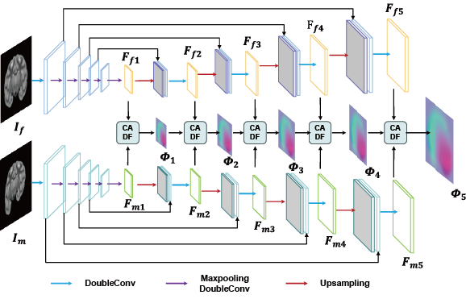
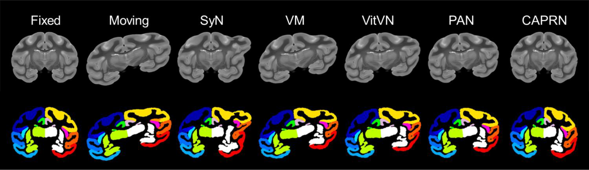

# CAPRNet (EMBC 2025)

Cross-Attention Progressive Registration Network for Large-Deformation Brain Slices

##  Abstract
Histological sections provide in-depth visualization of the fine anatomical structures of the brain, but this process disrupts the brain’s continuous spatial organization. To overcome this limitation, three-dimensional histological reconstruction based on image registration is a practical solution. However, the complex nonlinear deformations introduced during sample preparation severely degrade slice registration accuracy. In this work, we propose an unsupervised learning-based Cross-Attention Progressive Registration Network (CAPRN) to correct large-scale deformations in brain tissue slices. CAPRN uses a dual U-Net architecture to extract feature maps from the fixed and moving images independently. It utilizes the crossattention module to capture global correspondences between features. Moreover, CAPRN sequentially predicts deformation fields at multiple resolutions, from coarse to fine. We evaluate the registration performance of CAPRN on both macaque MRI slices and human histological slices. Compared to several benchmark methods, the proposed model achieves higher registration accuracy, demonstrating its potential in the nonlinear registration of brain slices, especially in cases with large deformations.

## *Model*

## *Results*

